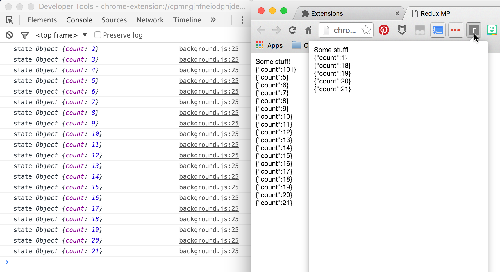

Redux Message Passer
====================

Redux Message Passer is an experimental (and naïve) store enhancer for [Redux][redux] to facilitate keeping multiple stores in sync with one "master" store via message passing.

[redux]:http://redux.js.org/

API
---

* **`enhancer = messagePasserServer(serverBridge)`**

  Creates a store enhancer for a "server" store, which maintains state, applies actions via a reducer, and sends state updates to client stores via message passing. `send` and `subscribe` may be generated from Bridge Generators (see below).

* **`enhancer = messagePasserClient(clientBridge)`**

  Creates a store enhancer for a "client" store which does not dispatch actions, but instead sends them to a server store for centralized application. `send` and `subscribe` may be generated from Bridge Generators (see below).

### Bridges

A bridge is a set of functions that tells Redux Message Passer exactly how to communicate over the message passing mechanism that your app utilizes. There are generators for common mechanisms (currently only Chrome extension).

**`serverBridge : { send, subscribe }`**

* `send(message)` - a user-provided function that takes a JSON-serializable `message` and ships it across whatever message passing mechanism the app is using to *all* subscribed client stores

* `subscribe(receive, notify)` - a user-provided function that subscribes to new client store requests to subscribe to this store for updates; use `receive` and `notify` to control the data flow as follows:

  * `receive(msg)` - call to receive an action request message from a client store and process it with the store enhancer
  * `notify(callback)` - when a new client store *first* connects to this server store, you should send it the current state of the store, which you can do by calling `notify` and sending the client the single message that is returned via the callback:

    ```javascript
    onClientConnect(client => {
      allClients.push(client)
      notify(message => sendToThisClientOnly(client, message))
    })
    ```

**`clientBridge : { send, subscribe }`**

* `send(message)` - a user-provided function that takes a JSON-serializable `message` and ships it across whatever message passing mechanism the app is using to the server store

* `subscribe(receive)` - a user-provided function that watches the app's message passing mechanism for incoming messages from the server store and calls `receive` with the value sent

#### Bridge Generators

* **`{ send, subscribe } = bridges.chrome.server(channelName)`**

  Creates `send` and `subscribe` functions to use with `messagePasserServer` that communicate via Chrome extension message passing across a channel named `channelName`

* **`{ send, subscribe } = bridges.chrome.client(channelName)`**

  Creates `send` and `subscribe` functions to use with `messagePasserClient` that communicate via Chrome extension message passing across a channel named `channelName`

Example Use
-----------

Imagine you have a Chrome extension with a background script and two content scripts. Data can only be shared between the scripts via message passing. You want the background script to be long-lived and control the redux state, and you want the content scripts to have access to a redux store *as if* it were local, but actually send all dispatches to the background script for processing.

`background.js`:

```javascript
const bridge = bridges.chrome.server('chrome_channel_name')

const serverStore = createStore(
  reducer,
  initialState,
  messagePasserServer(bridge)
)
```

`client1.js` (and other content scripts):

```javascript
const bridge = bridges.chrome.client('chrome_channel_name')

const clientStore = createStore(
  reducer,
  initialState,
  messagePasserClient(bridge)
)
```

Now, whenever a `clientStore` dispatches an action, that action will be packaged up and sent to the background script's `serverStore`. The background script will apply the update, and then send a message to all subscribed client scripts, asking them to update their store's current states.

The server store can additionally dispatch actions just like normal; the resulting state changes from those actions will also be distributed to the client stores.

Note that your stores can use other middleware and store enhancers via `compose` provided by Redux:

```javascript
import thunk from "redux-thunk"

const store = createStore(
  reducer,
  initialState,
  compose(
    applyMiddleware(thunk),
    messagePasserClient()
  )
)
```

Make sure you use `applyMiddleware` first so that the middleware functions you include generate serializable actions that Redux Message Passer can send to the server store.

Example
-------

To run the example Chrome extension:

1. Install all deps with `npm install` (this will also build the library with `npm run build`)
2. Build the extension with `npm run build-example`
3. Open `chrome://extensions` in your browser
4. Ensure "Developer mode" is checked
5. Click "Load unpacked extension..."
6. Select the `example` directory from this repo
7. From the extension panel, open the background page, options page, and click the action button in the toolbar; observe that the state is synchronized between the various runtime contexts


